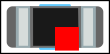
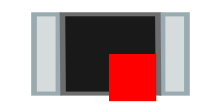

# PcbDraw-Lib

Model library for [PcbDraw](https://github.com/yaqwsx/PcbDraw) - tool for
creating awesome looking PCB drawings.

## Usage

Clone the repository to your computer and specify one of the directories as a
library when using PcbDraw. Currently there following libraries:

- `KiCAD-base` - module library in a standard style for components from KiCAD
  standard libraries.
- `Eagle-export` - module library in a standard style for components on imported
  Eagle boards. This library is held separately as the import of Eagle boards to
  KiCAD looses library information and component names do not follow KiCAD
  conventions.

## Important note for PcbDraw version > 0.6

PcbDraw v0.6 is the last version, that uses the old library format, where 1mm =
1 user unit. We no longer require this and you can use arbitrary units. The
library have been migrated, however, if you use custom libraries, you might have
to migrate them. You can do so by invoking `migrate_footprint.py` from the
directory `scripts` on every footprint. I am sorry about this breaking change,
but it will make creating the libraries less confusing for the future!

## Creating Modules

Module is an SVG file containing a single component drawing. There are some
rules below, but if you are interested in seeing a quick guide, jump to the
section "Module drawing walkthrough"

The file has to follow these rules:

- the SVG image of the component should have size and viewbox attributes set
- the units in the SVG should be chosen such that they correspond to the
  physical size
- it contains one element with `id=origin` having attributes `x` and `y`. Its
  coordinates serve as a module origin.
- origin should be a red rectangle of size 1x1.
- modules should not be too simplified (for example it is not OK for LED to be
  just a color circle).
- module is named exactly the same as the corresponding KiCAD footprint. The
  extension is changed to `.svg`.
- for each module there is a corresponding drawing with suffix '.back.svg' (for
  'pinheader.svg' there is a 'pinheader.back.svg'). This drawing contains view
  of the module from the other side of the board.
- each component should be placed on a tight canvas. The canvas size determines
  the highlighted area in component highlight.

Modules are placed in directories corresponding to KiCAD footprint libraries. If
multiple footprints are represented using one module, the module should not be
duplicated but symlinked.

Directory `scripts` contains script for automatic generation of modules - e.g.
pin headers, DIP packages, QFN packages, etc...

Side note: reasoning behind explicitly specifying origin. Even SVG format
supports units and origin can be placed at SVG (0,0) point, it not that easy in
practice. Most of the editors do weird things with coordinate system. Inkscape,
for example, reverses Y-axis and translates the origin by the initial size of
document. When you change the size of the document, the coordinates are not
modified. Therefor, I find placing origin component as the simplest solution
which should be compatible with any editor.

## Module drawing walkthrough

When you want to draw a component that is absent in the library, the easiest is
to use `scripts/create_template.py`. This small script takes a `*.kicad_mod`
file and outputs a SVG template for drawing. Let's say we would like to draw a
resistor. Therefore, we locate the corresponding `*.kicad_mod` file and invoke
it like this:

```
scripts/create_template.py --front \
  /usr/share/kicad/modules/Resistor_SMD.pretty/R_1206_3216Metric.kicad_mod \
  KiCAD-base/Resistor_SMD.pretty/R_1206_3216Metric.svg
```

This will generate the following `R_1206_3216Metric.svg` file:


As you can see, it is roughly the KiCAD footprint. There is a red square. This
square represent the footprint origin. Keep it in the file and don't move it!

With this set up, we can draw the footprint to be nice:



Once we are done, we can remove the "KiCAD footprint" layer:


Then we can shrink the document to size (under File -> Document Properties):


And Voilà! You just created a first, nicely-looking footprint:



Note that you can use the same procedure with the switch `--back` for the back
side of the component.


## Contributing

Please, help to increase usability of PcbDraw by adding more modules to the
library. Feel free to submit a pull request with new modules.
